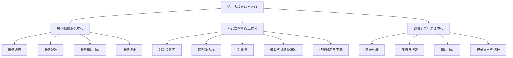
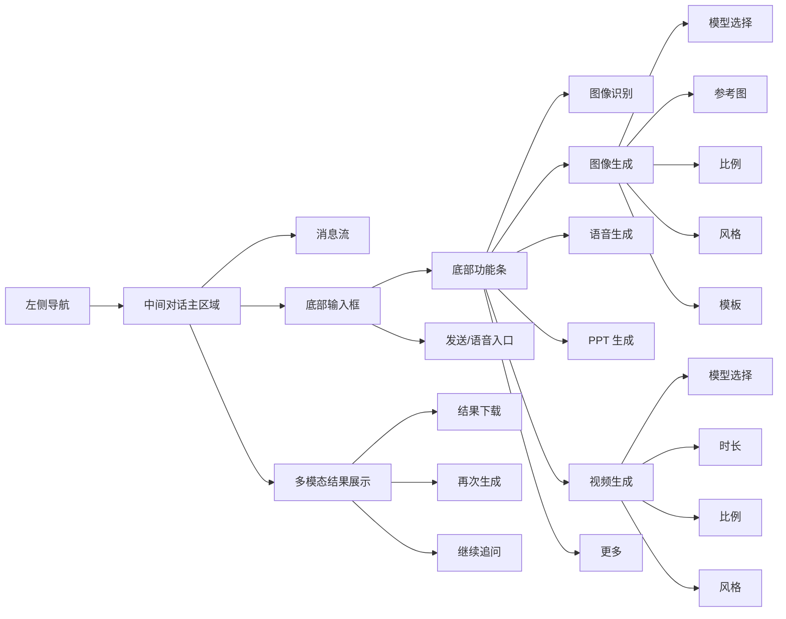

# 多模态应用入口需求分析与架构设计

## 1. 文档说明

本文档为“多模态应用入口”项目的主需求文档。文档在原始需求基础上进行了结构化优化，目标是将原本偏概念层的需求，升级为可用于产品设计、前端设计、后端设计、接口联调和验收测试的主 PRD。

本次优化重点包括：

- 明确项目不再是“多个独立能力页面”，而是“统一对话式多模态工作台”

- 明确系统由三大核心中心组成：模型配置服务中心、对话式多模态工作台、调用记录与统计中心

- 明确 MVP 必须完整支持图像识别、图像生成/文生图、文生语音、文生PPT、文生视频五类能力

- 明确五类能力的最小输入字段、结果展示方式、调用记录沉淀方式

- 明确下载、导出、删除、修改、统计等边界规则

- 明确接口规程与数据表规程的落地方向

本文档为主文档，详细规程拆分在以下附属文档中：

- `E:\shupai\Multimodal App Entry\interaction-state-machine.md`

- `E:\shupai\Multimodal App Entry\capability-input-rules.md`

- `E:\shupai\Multimodal App Entry\result-display-rules.md`

- `E:\shupai\Multimodal App Entry\invoke-record-rules.md`

- `E:\shupai\Multimodal App Entry\page-component-rules.md`

- `E:\shupai\Multimodal App Entry\api-rules.md`

- `E:\shupai\Multimodal App Entry\data-schema-rules.md`

---

## 2. 项目背景

### 2.1 当前现状

公司当前已经具备模型底座与模型接口能力，模型中心能够提供模型服务管理与调用能力，但平台侧仍然缺少面向业务用户的统一多模态应用入口，导致存在以下问题：

- 用户无法在统一界面中直接使用图像识别、图像生成、文生语音、文生PPT、文生视频等能力

- 不同能力缺少统一交互入口与统一调用体验

- 模型虽然存在，但缺少面向业务的模型服务化配置能力

- 调用记录缺少产品化的列表、详情、统计、导出、管理能力

- 结果文件缺少统一预览与下载出口

### 2.2 项目本质

本项目不是底层模型训练项目，也不是模型中心重构项目，而是：

**基于已有模型底座，建设统一的多模态对话式应用入口。**

该入口需要同时解决三个问题：

- 模型能力如何被配置

- 模型能力如何被工作台使用

- 模型调用结果如何被记录、下载、统计与管理

---

## 3. 建设目标

### 3.1 总体目标

建设一个可配置、可调用、可追踪的多模态应用入口，使平台使用者能够在统一界面中完成：

- 多模态能力选择

- 模型选择与参数配置

- 任务发起与结果查看

- 结果文件下载

- 调用记录查看、导出、管理与统计

### 3.2 MVP 目标

MVP 版本要求完整实现以下五类能力：

- 图像识别

- 图像生成 / 文生图

- 文生语音

- 文生PPT

- 文生视频

以上五类能力在 MVP 中必须都满足统一闭环：

- 可通过功能条进入

- 可选择模型

- 可配置最小参数集

- 可发起调用

- 可在消息流中展示结果

- 可下载结果

- 可进入调用记录中心查看与导出

### 3.3 一句话定义

本项目是一个基于已有模型底座的“统一对话式多模态应用工作台”，同时配套“模型配置服务中心”和“调用记录与统计中心”。

---

## 4. 产品定位

系统围绕三个核心功能中心展开：

- 模型配置服务中心

- 对话式多模态工作台

- 调用记录与统计中心

### 4.1 模型配置服务中心

该中心用于将已有模型底座中的接口能力，配置为前台可以直接消费的“模型服务”。

它不负责底层模型训练或底层模型仓库管理，而是负责：

- 管理可发布的模型服务项

- 配置服务与功能的绑定关系

- 配置默认模型与候选模型

- 配置前台可见参数项

- 配置调用说明、状态、统计信息

页面风格建议参考类似 `CC-switch` 的“服务管理 + 列表 + 右侧抽屉详情”模式。

### 4.2 对话式多模态工作台

该中心是系统主使用入口，整体交互形态参考豆包类产品。

用户在统一对话界面中完成：

- 自然语言输入

- 多模态能力快速切换

- 模型与参数选择

- 结果查看

- 结果下载

- 基于上下文继续追问或再次生成

### 4.3 调用记录与统计中心

该中心用于展示和管理模型调用情况，页面风格参考“列表 + 右侧抽屉详情”的业务台账模式。

它不仅承担历史查看作用，还应支持：

- 调用记录列表查看

- 单条调用记录详情查看

- 结果文件下载

- 单条记录导出与列表导出

- 记录级统计与汇总统计

- 记录备注、标签、摘要管理

- 记录软删除

### 4.4 使用范围说明

当前版本不对系统使用对象做管理员与普通用户的细分要求，文档以统一使用者视角描述需求。

本期重点是先完成三大核心功能中心的产品闭环，角色权限控制、精细化授权等内容可在后续版本补充。

---

## 5. 总体需求范围

### 5.1 本期建设范围

- 模型配置服务中心

- 对话式多模态工作台

- 调用记录与统计中心

- 结果文件下载

- 调用记录导出

- 基础统计分析

### 5.2 首批能力范围

当前首要完成以下五类多模态能力：

- 图像识别

- 图像生成 / 文生图

- 文生语音

- 文生PPT

- 文生视频

上述能力都需要在对话工作台中具备对应的功能条入口，并支持模型选择及参数配置。

### 5.3 后续扩展能力

以下能力可在后续版本通过“更多”能力组逐步补充：

- 快速问答

- 帮我写作

- 翻译

- 编程

- 数据分析

- AI 播客

- 深入研究

- 记录会议

说明：

- 本文档以“文生图”作为工作台重点示例能力

- 其他能力可复用同一套工作台交互框架进行扩展

---

## 6. 对话工作台需求

### 6.1 页面布局要求

对话工作台建议采用如下结构：

- 左侧：系统主导航

- 中间：对话主区域

- 底部：输入框、功能条、参数快捷项

- 参数配置方式：通过底部下拉框、弹层、选择器展开

说明：

- 对话平台不以“右侧固定参数侧栏”作为主交互方式

- 模型、比例、风格、模板等参数在底部功能条附近展开

- 右侧抽屉样式更适合用于模型配置服务中心和调用记录中心的详情管理

### 6.2 对话主区域

中间区域用于承载完整的对话流，包括：

- 用户输入内容

- 系统回复文本

- 图片生成结果

- 视频生成结果

- 语音生成结果

- PPT 生成结果

- 图像识别结果

- 上下文追问与继续生成

所有结果均应在当前消息流中展示，而不是跳转到独立结果页。

### 6.3 功能条与参数快捷项

底部功能条是当前工作台的核心操作入口。

首批功能条应覆盖：

- 图像识别

- 图像生成

- 语音生成

- PPT 生成

- 视频生成

每个功能进入后，应支持展示相应参数快捷项，例如：

- 模型选择

- 比例选择

- 风格选择

- 模板选择

- 参考图上传

- 时长选择

- 发音人选择

- 输出格式选择

- 识别方式选择

### 6.4 直接对话触发能力

当用户未主动点击功能条时，仍应允许直接输入自然语言。系统应支持：

- 自动识别用户意图

- 自动匹配到对应能力

- 自动选择默认模型服务

- 若识别不明确，回退至普通对话模式或给出确认提示

### 6.5 交互规则

统一交互规则如下：

- 若用户已手动选择功能，则按所选功能处理

- 若用户未选择功能，则执行意图识别

- 切换功能后，底部参数项随之变化

- 当前会话内已选模型、风格、比例等参数可以沿用，除非用户主动修改

- 结果始终回流到对话流中，并支持直接下载

- 基于上一轮结果继续生成时，应创建新任务，而不是修改旧任务

详细交互状态机规则以 `E:\shupai\Multimodal App Entry\interaction-state-machine.md` 为准。

---

## 7. 五类能力 MVP 最小输入范围

### 7.1 图像识别

- 输入图片

- 模型

- 识别方式

### 7.2 图像生成 / 文生图

- prompt

- 模型

- 参考图

- 比例

- 风格

- 模板

- 生成张数

### 7.3 文生语音

- 输入文本

- 模型

- 音色 / 发音人

- 语速

- 输出格式

### 7.4 文生PPT

- 主题

- 大纲

- 模型

- 页数

- 模板风格

- 输出格式

### 7.5 文生视频

- prompt

- 模型

- 时长

- 比例

- 风格

- 参考图

字段级规则详见：`E:\shupai\Multimodal App Entry\capability-input-rules.md`

---

## 8. 结果展示与下载需求

### 8.1 统一结果展示原则

- 所有结果统一回流到对话消息区

- 一次提交对应一张任务结果卡

- 成功后结果卡替换任务卡

- 所有文件型结果支持下载

- 结果卡优先支持继续使用，而不是只做静态展示

### 8.2 五类能力结果形态

- 图像识别：文本/结构化结果卡

- 图像生成 / 文生图：图片网格结果卡

- 文生语音：音频播放器卡

- 文生PPT：PPT 文件卡

- 文生视频：长任务状态卡 + 视频结果卡

### 8.3 下载要求

系统需支持三类下载：

- 结果文件下载

- 历史结果下载

- 调用记录导出下载

下载与结果展示细则详见：`E:\shupai\Multimodal App Entry\result-display-rules.md`

---

## 9. 模型配置服务中心需求

模型配置服务中心需要明确区分三个概念：

- 模型：底层模型能力本体

- 模型服务：对外发布给工作台消费的服务实例

- 功能绑定：某个前台能力默认绑定什么服务、可切换哪些服务

本中心至少支持：

- 模型服务列表查看

- 服务新增与修改

- 服务启停

- 功能与模型服务绑定

- 参数能力配置

- 服务详情与统计查看

### 9.1 模型服务基础信息配置

每个模型服务应至少支持：

- 服务名称

- 服务编码

- 模型名称

- 模型编码

- 模型类型

- 所属能力分类

- 服务地址或接口标识

- 接口协议

- 鉴权方式

- 超时时间

- 是否启用

- 备注说明

### 9.2 服务化配置能力

系统需支持围绕“服务”进行配置，而不是只记录模型本身：

- 一个服务对应哪个模型

- 一个服务属于哪类功能

- 一个功能默认绑定哪个服务

- 一个功能允许用户选择哪些服务

- 一个服务当前是否发布、停用或失效

---

## 10. 调用记录与统计需求

### 10.1 调用记录定义

一条调用记录表示一次实际模型调用行为，不等于一整段会话，也不等于一整轮对话。

系统需明确区分：

- 会话

- 消息

- 任务

- 调用记录

### 10.2 记录中心要求

调用记录中心至少支持：

- 记录列表查看

- 条件筛选

- 抽屉详情查看

- 下载结果文件

- 导出记录

- 修改备注、标签、摘要

- 删除记录（软删除）

- 查看基础统计信息

### 10.3 记录修改与删除边界

允许修改：

- 备注

- 标签

- 请求摘要

不允许修改：

- 模型服务

- 请求参数

- 调用状态

- 调用时间

- 结果类型

- 结果文件

删除规则：

- 只做软删除

- 记录状态改为 `deleted`

- 不做物理删除

详细规程见：`E:\shupai\Multimodal App Entry\invoke-record-rules.md`

### 10.4 统计要求

MVP 统计先收敛核心指标：

- 调用次数

- 成功率

- 平均耗时

- token用量

- 调用趋势

- 调用明细

统计维度建议先支持：

- 按能力

- 按模型服务

- 按时间

---

## 11. 页面组件设计要求

页面组件建议按三层组织：

- 布局层

- 业务容器层

- 业务组件层

### 11.1 核心页面容器

- 工作台容器

- 模型服务中心容器

- 调用记录中心容器

### 11.2 核心业务组件

- 消息流

- 输入区

- 功能条

- 参数快捷项

- 任务状态卡

- 结果卡

- 服务列表

- 记录列表

- 右侧详情抽屉

详细规程见：`E:\shupai\Multimodal App Entry\page-component-rules.md`

---

## 12. 接口设计要求

### 12.1 接口总体原则

- 统一响应结构

- 统一能力编码

- 统一任务模式

- 统一文件引用方式

### 12.2 工作台接口

至少包括：

- 查询功能条配置

- 查询某能力的参数与模型配置

- 发起对话式任务

- 查询任务详情

- 上传文件

- 下载结果文件

### 12.3 记录中心接口

至少包括：

- 查询调用记录列表

- 查询单条调用记录详情

- 修改记录管理信息

- 删除记录（软删除）

- 导出单条记录

- 导出记录列表

### 12.4 模型服务中心接口

至少包括：

- 查询模型服务列表

- 查询模型服务详情

- 新增模型服务

- 修改模型服务

- 启停模型服务

- 查询模型服务统计

详细规程见：`E:\shupai\Multimodal App Entry\api-rules.md`

---

## 13. 数据结构设计要求

### 13.1 核心业务对象

建议显式区分：

- 功能配置

- 模型服务配置

- 会话

- 消息

- 任务

- 调用记录

- 文件资产

### 13.2 MVP 核心表

建议 MVP 至少包含以下表：

- `capability_config`

- `model_service_config`

- `conversation`

- `message`

- `task`

- `invoke_record`

- `file_asset`

增强表：

- `record_download_log`

- `stats_snapshot`

### 13.3 数据设计硬规则

- 任务参数、记录参数都存快照，不依赖配置表反查历史

- 调用记录删除只做软删除，不做物理删除

- 记录修改仅允许修改备注、标签、摘要等管理信息，不改调用事实

- 输入文件与输出文件统一走文件表，不在主表中堆路径字段

- 会话、消息、任务、记录四层对象明确分离

详细规程见：`E:\shupai\Multimodal App Entry\data-schema-rules.md`

---

## 14. 验收标准

### 14.1 工作台验收

- 页面布局符合“左侧导航 + 中间对话区 + 底部功能条”的形态

- 图像识别、图像生成、文生语音、文生PPT、文生视频五类能力均有对应功能条入口

- 用户进入能力后可看到模型、比例、风格、模板等详细选项

- 不选择功能条时，直接输入自然语言也能识别并触发相应能力

- 结果能在对话区正常展示并支持下载

### 14.2 模型配置验收

- 能按服务化方式配置模型

- 能配置功能与模型绑定关系

- 能配置默认模型与候选模型

- 能配置前台参数项并影响工作台展示

### 14.3 调用记录验收

- 能查看调用记录列表

- 能查看单条记录使用了什么模型、什么参数、什么结果

- 能从记录详情中下载对应结果

- 能导出单条记录与记录列表

- 能修改备注、标签、摘要

- 能软删除记录

- 能查看基础统计信息

### 14.4 五类能力验收

五类能力都必须满足：

- 能进入能力

- 能选模型

- 能配参数

- 能发起调用

- 能返回结果

- 能下载结果

- 能查看记录

- 能导出记录

---

## 15. 架构关系图

## 16. 前台交互架构图

## 17. 实施建议

建议开发顺序如下：

1. 模型配置服务中心基础能力

2. 对话工作台框架与交互状态机落地

3. 文生图能力完整打通

4. 图像识别、文生语音、文生PPT、文生视频补齐

5. 结果下载与文件管理打通

6. 调用记录中心打通

7. 统计中心打通

## 18. 结论

优化后的主需求文档，不再停留在“做一个多模态入口”的概念层，而是已经明确了：

- 产品结构

- 页面形态

- 五类能力最小输入边界

- 结果展示边界

- 记录与统计边界

- 配置中心边界

- 接口与数据结构边界

- 验收边界

在此基础上，后续可以继续推进原型设计、前后端任务拆解、数据库 SQL 设计与接口联调。